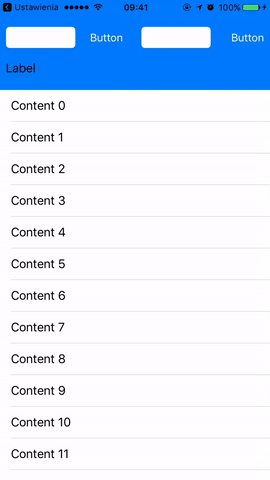
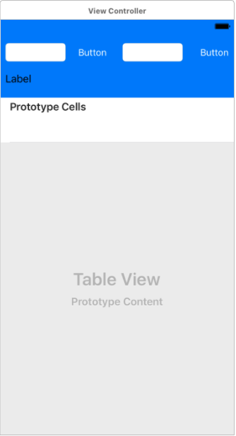
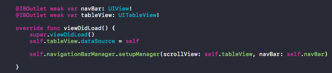

__HMScrollNavigationBar__
-----

Probably everyone saw navigation bar in Facebook app, that is hiding or showing while scrolling your view. Now you can have the same feature!

## Example

## Installation

### CocoaPods

HMScrollNavigationBar is available through [CocoaPods](http://cocoapods.org).

	pod 'HMScrollNavigationBar'

### Carthage

HMScrollNavigationBar is available through [Carthage](https://github.com/Carthage/Carthage).
	
	github "HandcraftedMobile/HMScrollNavigationBar"

## Usage

1. Prepare your view in IB.

2. Setup your navigationBarManager.

3. Sit back and run your application.

## Contributors

## License

MIT. See LICENSE file for details.